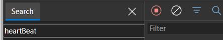
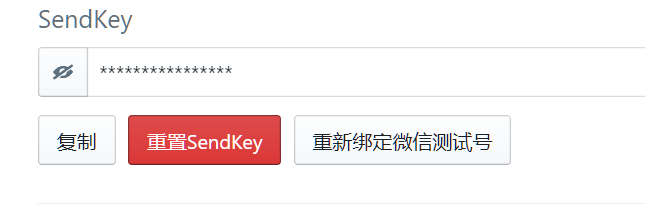

# 【第 2 章】 原料准备篇

---

本文基于项目的中立立场，对云函数平台不做具体的推荐。这里只是告诉你需要准备哪些东西。

## 2.1 获取哔哩哔哩账号的cookie

1. 打开你的浏览器，登录你的哔哩哔哩账号

2. 随便进入一个直播间（最好是那种没开播也没有轮播的那种啦）  

   - [简易传送门](https://live.bilibili.com/23678066)

3. 确认登陆上了自己的账号后，停留在这个页面，点击一下键盘上的`F12`或者`鼠标右键`->检查，进入开发者工具  

   - 点击`网络`/`NetWork`选项卡  
     

   - 进入该选项卡后，点一下键盘上的`F5`或浏览器左上角刷新页面  

   - 在这个页面中找一下一个长得像放大镜的图标，点一下它  

   - 在搜索框输入**heartBeat**或**webHeartBeat**

    

   - 双击找到的那个heartBeat，点一下`Headers`或者`标头`项，找一下一个叫Cookie的项并复制保留（图中浅蓝色部分），复制完之后回到桌面`右键`新建一个txt，粘贴过来保存一下。  

      

::: tip
有了cookie能操作B站账号的大部分功能，记得不要分享出去或者提问的时候带上这个哦
:::

## 2.2 一个云服务供应商的账号

（注册就不用我教你了8，下面的部署以腾讯云为例嗷

## 2.3 获取Server酱的SendKey  

1. [Server酱传送门](https://sct.ftqq.com/)
- 点击"登入"（这里可能需要你自己注册嗷）  

- 微信扫码后点击下面的“扫码后点此继续”
- 登录成功后你能看到这个  

- 点击复制，复制完之后回到桌面`右键`新建一个**新的**txt，粘贴过来保存一下。

## 2.4 你的进度

如果上面的原材料你都准备好了的话，你已经拿到了开启新世界大门的钥匙。那还等什么，让我们快点进入下一章，走进这扇门吧！

> ⬛⬛⬜ 66%