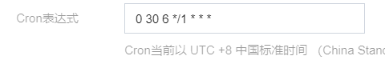
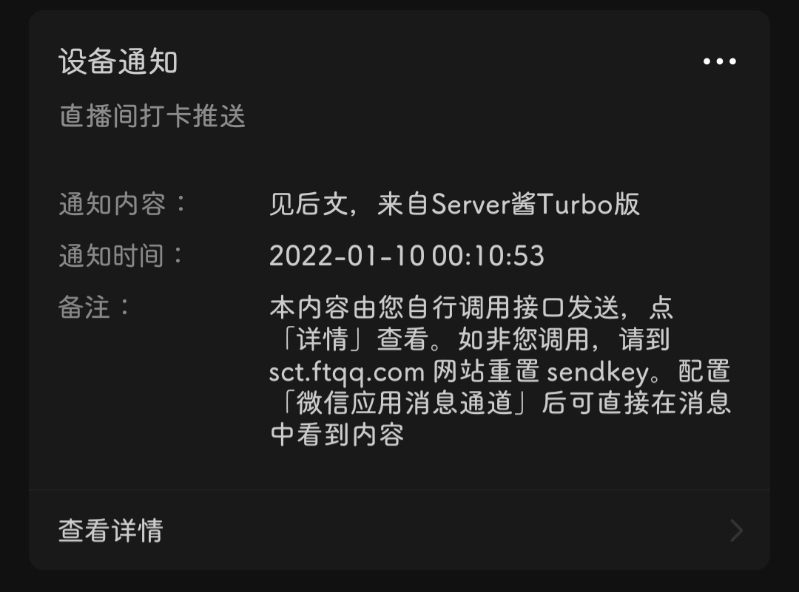

# 【第 3 章】 函数部署篇

## 3.1 下载云函数压缩包(二选一)
- [Github](https://github.com/XiaoMiku01/bili-live-heart/releases/tag/0.8.0)
- [百度云](https://pan.baidu.com/s/1af5-r6Xpzmqmg44DQXW3xA) 提取码：soul  

## 3.2 部署代码上云

- 登录[腾讯云函数官网](https://cloud.tencent.com/product/scf) 并进入控制台  
  

---

- 选择函数服务 - 新建  
  

---

- 选择自定义创建 - 事件函数-函数名称随意-地域国内随意(最后不要选广州) - 代码部署 - 运行环境选择Python3.6  
  

---

- 提交方法选择本地上传zip包 - 执行方法**默认不要改** - 函数代码上传刚刚下载的压缩包  
  

---

- 点开高级配置 - 环境配置  

先到下面把**异步执行**打钩,再回到上面填执行超时时间，不少于7500秒  
环境变量填写自己B站uid，B站cookie（[【第 2 章】 原料准备篇](./ch02-preparation.md)），需要赠送小心心的主播uid（ruid，不填则只进行签到不赠送小心心**只能填一个**）弹幕打卡的不需要填写，会自动打卡，Server酱的SendKey（[【第 2 章】 原料准备篇](./ch02-preparation.md)）  
::: tip
**key栏中的字母全为小写 右边一栏才是你填的**
:::

- 其他配置不变 - 展开触发器配置  
选择自定义创建 - 触发方式：定时触发 - 触发周期：每一天

- 点击**完成**
- 等创建成功后点击**立即转跳**
  

---

- 点击左边的函数管理 - 函数代码 - 左下角 - 测试  
  

  

---

- 耐心等待10-15分钟，查看返回日志是否运行成功  

---

- 点击左边的触发管理 - 创建触发器 - 其他配置不变 - 自定义触发周期
在**Cron表达式**里面填上  
`0 30 6 */1 * * *`  

- 点击**提交**

---

- 如果一切顺利的话，你每天都可以在微信看到两条这样的消息

::: tip
函数运行需要时间，所以不会准点给你发消息嗷
:::

---

## 3.3 你的进度

> ⬛⬛⬛ 99%

为什么是99%呢，因为还差给这个项目点个小心心啦(≧∇≦)ﾉ